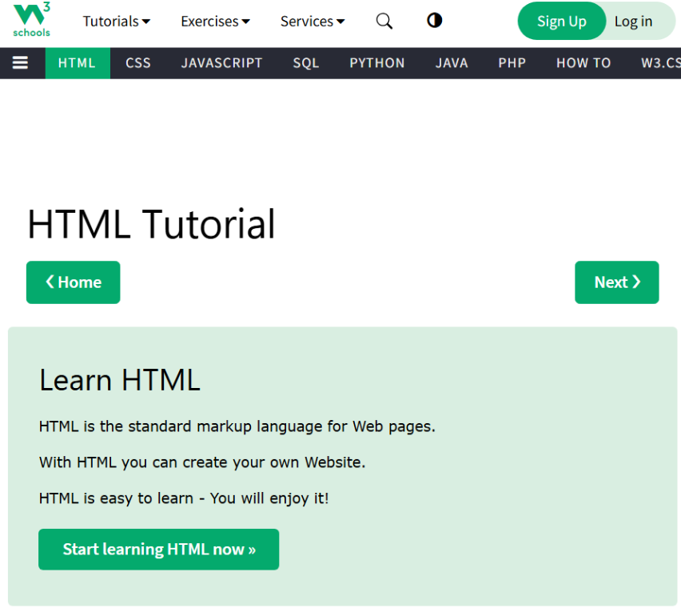
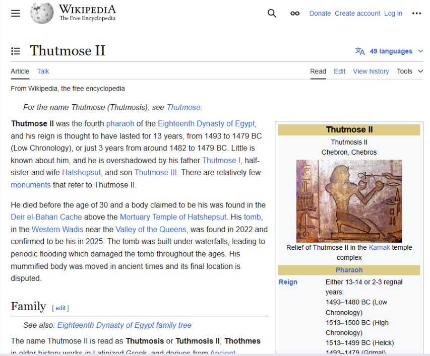
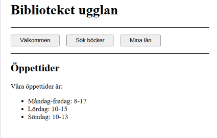
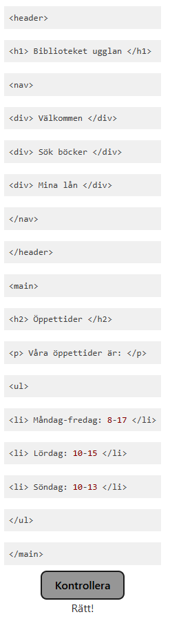

# Webben

## 1 Diskutera i grupp
Ni kan göra den här uppgiften antingen direkt, eller senare i veckan. Om ni gör den senare, passa på att kombinera med code review.

1a Vilka sorters HTML-element kan du se på w3schools-sidan?


Efter första observation skulle jag nog säga att hemknappen top vänster hörn är en
`` <a href="...">
    
</a>``

- HTML Tutorial = h1
- Learn Html = h2
- HTML is the standard markup language for Web pages. = p
- With HTML you can create your own Website. = p
- HTML is easy to learn - You will enjoy it! = p
- Alla knappar som tar användaren till en ny plats är ``a href``
- Hamburgar ikonen, halvmånen, förstroringsglaset, är nog definitivt ``buttons``. Om Tutorial, Exercises och services öppnar den dropdown när man trycker på dem är de också buttons, om de istället tar oss till något nytt är de ``a href``
---
1b Vilka sorters element finns det på wikipedia-sidan om Thutmose II?


- All brödtest är ``p`` men de blåmarkerade orden är ``a href``.
- All dividers på sidan horisontella linjer är förmodligen border-bottom .
- hamburgaren i top vänster är nog en button, detsamma med hamburgaren under.
- Language är nog en button också.
- Rutan till höger med bild och information är nog en ``<table``>
- Inuti den finner vi ``, <p>, <a href>``.
---
1c Koden för webbsidan har råkat blandas. Byt plats på kodraderna så att de står i samma ordning som på bilden. Länk till uppgiften. 



Rätt till uppgiften blir som följande:


---

1d. Hitta så många fel som möjligt i följande HTML. 
```
<main>
<section>
<h1> Find the error
<p> This is an example of an HTML file. It contains several errors.

<p> Can you find them all? </p>
</p>
</main>
```
- Först h1 på rad 3 saknar en stängning
- img är av ogiltigt syntax och saknar src.
- section saknar stängning innan main stängning.
- p stängning saknas på rad 4  
- ensam p stängning på rad 7
---